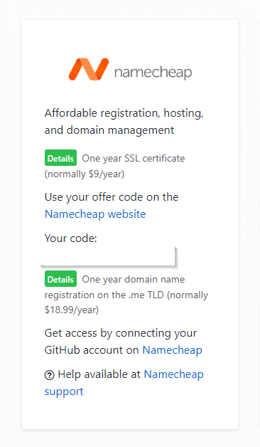
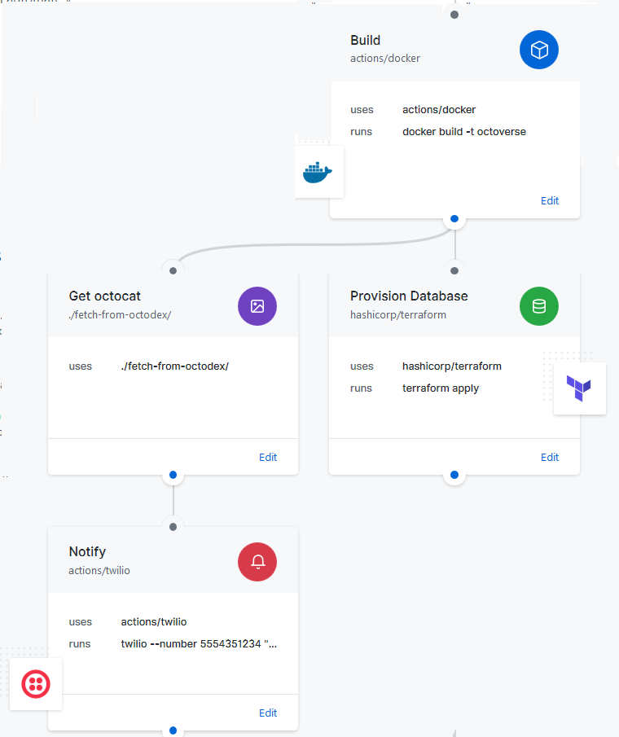

<center> <h1>GitHub Crash Course</h1> </center>
<center> <h2>16 Jan 2019</h2> </center>

<center>  </center>

### Technical Requirements
Need to be able to run `git` commands from terminal:
* usually pre-installed on Linux
* for MacOS, get from [git-scm.com](https://git-scm.com/download/mac)
* for Windows, need [git bash](https://git-scm.com/download/mac) (= `git` + terminal)

### Python packages used in this presentation
* `RISE`
* `jupyter-notebook`
* `markdown`
* `cookiecutter`
* `pelican`

## Contributing to a GitHub project from web + command line
1. <Github.com> fork `<interesting>` repo

2. ```bash
git add upstream <URL of interesting repo (before fork)>```

3. ```bash
git checkout -b <branch name>```

4. \*Make changes*

5. ```bash
git add .```

6. ```bash
git commit -m <summary message (keep it short)>```

7. ```bash
git push origin <branch name>```

8. <Github.com> submit pull request (**PR**)--*from your fork to the original repo*

## FuCk Add Commit Push (Repeat)
Fork Upstream Checkout Add Commit Push

## Contribute to Repo with GitHub Desktop GUI
<center></center>

## Create a repo from scratch and upload to GitHub from command line

Create and enter empty folder, then
```bash
git init```
Make changes
```bash
git add .```
```bash
git commit ```
```bash
git remote add origin <remote repository URL>```
```bash
git push origin master```

## Create a repo from scratch with GitHub Desktop GUI (or GitHub website)
<center></center>

## Create repo from scratch with `cookiecutter`
1. Search through cookiecutter templates either [on the main project](https://github.com/audreyr/cookiecutter#categories-of-cookiecutters) or via google search (e.g. 'cookiecutter machine learning image classification')
2. Read the requirements.txt (or listed requirements in README) and build the correct virutal environment (e.g. Python 3.5, etc.)
3. From command line `cookiecutter https://github.com/drivendata/cookiecutter-data-science`

# Host a (static) webpage with GitHub: GitHub Pages
[Hello World tutorial](https://pages.github.com/)

## [Pelican](http://docs.getpelican.com/en/stable/)
### Install
execute `conda install pelican Markdown`
OR `pip install pelican Markdown` <br>

### Make a folder
Good folder structure for new project
```bash
pelican/
| - pelican-themes
| - other-pelican-theme
| - other-sites
| - <username>.github.io```

### `pelican-quickstart`
Dialogue Generates
```bash
    <username>.github.io/
    | - content
    | - output
    | - pelicanconf.py
    | - publishconf.py```

### Create human content
RST seems most common <br>
Markdown acceptable<br>
* must have title line, can include date, and category<br>
** Title: My First Review<br>
** Date: 2010-12-03 10:20 <--Optional<br>
** Category: Review <--Optional<br>
* uses different syntax for code blocks<br>
** `::python` ==> no line numbers<br>
** `#!python` ==> line numbers

### Generate web content
```bash
pelican content \
--debug \
--autoreload \
--output output \
--settings pelcanconf.py```

### Serve web content

```python
python -m pelican.server```
visit http://127.0.0.1:8000

### Publish web content
```bash
pelican content \
--output output \
--settings pelcanconf.py```

### Publish web content on Github
From within < username >.github.io/ local folder<br>

(If < username >.github.io repo not already cloned)
```bash
(git init) 
(git remote add origin https://github.com/<username>/<username>.github.io.git)
git add .
git commit -m <message>
git push origin master --force```
Version control on output is not necesarry (keep it on your source code)<br>
This updates the `origin/master` branch, which will be the actual site when you go to <username>.github.io

### Publish source code on Github
#### add `.gitignore`
Tell git (and GitHub) to ignore the `output/` folder<br>
--> put the text `output` in a new (or already-existent) .gitignore file<br>

(If < username >.github.io repo not already cloned)
```bash
(git init)
(git remote add origin https://github.com/<username>/<username>.github.io.git)
git branch -m master source <--moves master branch to new branch 'source'
git add . #This also adds .gitignore
git commit -m <message>
git push origin source
```
This creates the second branch `origin/source` that contains the source code

### Automating source / content update
```bash
python -m pelican content \
--output output \
--settings pelcanconf.py
git add -A
git commit -m "Deploying changes to source branch"
git push origin source
cd output
git add -A
git commit -m "Deploying changes to master branch"
git push origin master```

## Other Good Things from Github
["How to automate publishing of new Pelican pages to GitHub pages via Travis-CI"](https://iranzo.github.io/blog/2018/12/07/elegant-website-ci/)


<center> <h1>Other Good Things from Github</h1> </center>
[Use a custom domain with Github Pages](https://help.github.com/articles/using-a-custom-domain-with-github-pages/)
<center></center>

<center> <h1>Other Good Things from Github</h1> </center>
[GitHub Actions](https://github.com/features/actions/)
<center></center>

<center> <h1>All Good Things Come to an End</h1> </center>